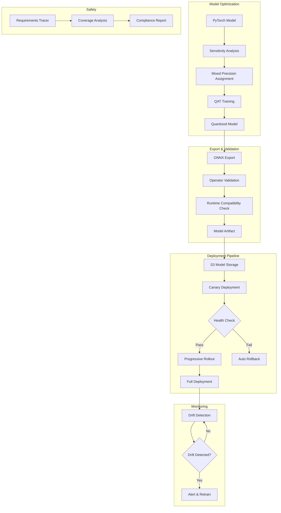
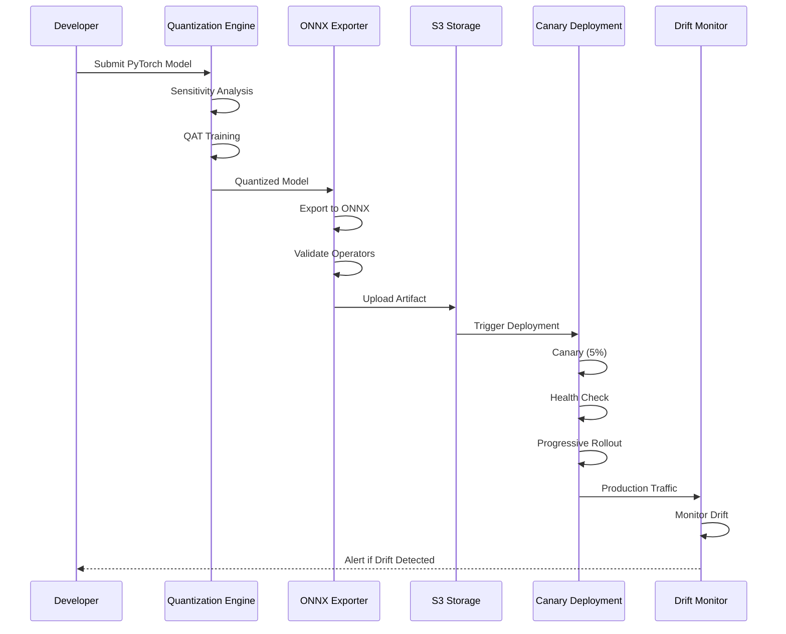
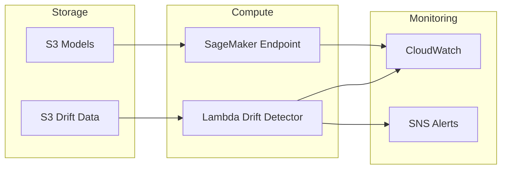

# EdgeDeploy Architecture

## Overview

EdgeDeploy is an ISO 26262-compliant MLOps pipeline for deploying machine learning models to automotive edge devices. It provides quantization, drift detection, safety traceability, and progressive deployment capabilities.

## System Architecture

## Core Components

### 1. Quantization Engine (`src/optimization/`)

Responsible for model compression while maintaining accuracy:

- **Per-Layer Sensitivity Analysis**: Quantizes each layer individually to measure accuracy impact
- **Mixed Precision Assignment**: INT8 for insensitive layers, FP16/FP32 for sensitive ones
- **QAT (Quantization-Aware Training)**: Fine-tunes with fake quantization for accuracy recovery
- **Pareto Frontier**: Visualizes compression vs accuracy trade-offs

### 2. Drift Detection (`src/drift/`)

Ensemble approach to detect data distribution shifts:

- **PSI (Population Stability Index)**: Detects univariate feature drift
- **MMD (Maximum Mean Discrepancy)**: Detects multivariate distribution shifts
- **ADWIN**: Adaptive windowing for streaming concept drift
- **Weighted Voting**: Combines detectors with configurable weights
- **Persistence Filter**: Requires multiple consecutive detections

### 3. Safety Traceability (`src/safety/`)

ISO 26262 compliant requirements management:

- **Bidirectional Graph**: Parent↔Child requirement links
- **BFS Traversal**: Impact analysis for change management
- **ASIL Support**: QM through ASIL-D levels
- **Gap Detection**: Identifies missing tests/implementations
- **Compliance Scoring**: Automated assessment reporting

### 4. Canary Deployment (`src/deployment/`)

Progressive rollout with automatic rollback:

- **Multi-Stage**: 5% → 25% → 50% → 100%
- **Health Monitoring**: Success rate, latency, accuracy
- **Traffic Routing**: Consistent hashing for stable routing
- **Auto-Rollback**: Triggers on threshold violations

### 5. ONNX Export (`src/export/`)

Model conversion and validation:

- **PyTorch → ONNX**: With dynamic batch dimension
- **Operator Validation**: Checks runtime compatibility
- **Inference Testing**: Verifies numerical equivalence
- **Multi-Runtime**: ONNXRuntime, TensorRT, OpenVINO support

## Data Flow

## AWS Infrastructure

## Security Considerations

1. **Model Artifacts**: Encrypted at rest (S3 SSE)
2. **Endpoint**: IAM role with least privilege
3. **Secrets**: No credentials in code, use environment variables
4. **Audit**: CloudTrail logging enabled

## Performance Targets

| Metric | Target |
|--------|--------|
| Model Compression | 3-4x (INT8) |
| Accuracy Retention | >97% |
| Inference Latency | <100ms |
| Drift Detection | <5 min |
| Deployment Rollback | <30 sec |

## ISO 26262 Compliance

- **Part 6**: Software development (requirements tracing)
- **Part 7**: Production and operation (deployment)
- **Part 8**: Supporting processes (verification)

